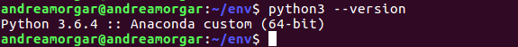

# Ejercicios del tema 1

### 1. Instalar alguno de los entornos virtuales de node.js (o de cualquier otro lenguaje con el que se esté familiarizado) y, con ellos, instalar la última versión existente, la versión minor más actual de la 4.x y lo mismo para la 0.11 o alguna impar (de desarrollo).

En mi proyecto voy a utilizar *Python*, por lo que voy a instalar uno de los entornos virtuales para el mismo.
Seguimos los siguientes pasos:
1. Instalamos un entorno virtual, en este caso se ha elegido **env**

2. Creamos un entorno mediante virtualenv, al que llamamos env:

3. Accedemos al entorno, como se puede ver en la imagen que se muestra a continuación:

Por último vamos a consultar la versión de Python instalada. Como se puede ver en la imagen, esta versión se corresponde con la última versión estable (3.6.4)

